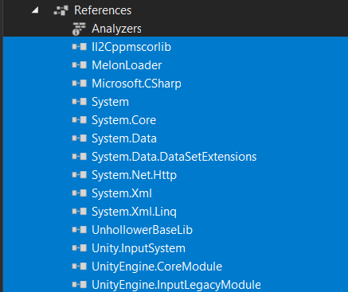
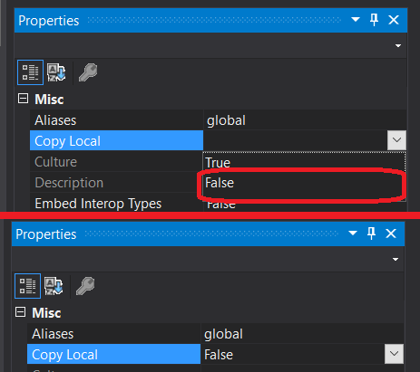
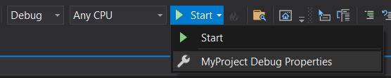

# Writing Mods

So, YOU want to start writing mods for house party?

This document explains how to setup your modding environment and provides general tips to get started.

**This document assumes that you have a fair grasp of:**

- the C# programming language 
- basic knowledge of Visual Studio
- basic knowledge of the Unity Engine
- basic knowledge of dnSpy

**Requirements**
- [MelonLoader](https://github.com/HerpDerpinstine/MelonLoader/releases/latest/download/MelonLoader.Installer.exe)
- [dnSpy](https://github.com/dnSpy/dnSpy/releases/download/v6.1.8/dnSpy-net-win64.zip)
- [Il2CppAssemblyUnhollower](https://github.com/knah/Il2CppAssemblyUnhollower/releases/download/v0.4.18.0/Il2CppAssemblyUnhollower.0.4.18.0.zip)

Make sure to download all the requirements, put them into one folder for easy access.

## What is

### MelonLoader
[MelonLoader](https://melonwiki.xyz/#/) is a Universal Mod-Loader for Games built in the Unity Engine.

### dnSpy
[dnSpy](https://github.com/dnSpy/dnSpy) is a debugger and .NET assembly editor. You can use it to edit and debug assemblies even if you don't have any source code available.

### Il2CppAssemblyUnhollower
[Il2CppAssemblyUnhollower](https://github.com/knah/Il2CppAssemblyUnhollower) is a tool to generate Managed->IL2CPP proxy assemblies from [Il2CppDumper](https://github.com/Perfare/Il2CppDumper)'s output.


# Getting Started

Make sure you have installed the game and atleast started the game once before you continue.

1. Download [MelonLoader.Installer.exe](https://github.com/HerpDerpinstine/MelonLoader/releases/latest/download/MelonLoader.Installer.exe)
2. Run MelonLoader.Installer.exe.
3. Click the SELECT button.
4. Select and Open the Game's EXE in your Game's Installation Folder.
5. Select which Version of MelonLoader to install using the Drop-Down List. (Or leave it as-is for the Latest Version.)
6. Click the INSTALL or RE-INSTALL button.
7. To extract everything we need, start the game atleast once with melonloader installed.

After this the installation directory of the game should contain a couple of new folders where the most interesting folders are:

- Steam\steamapps\common\House Party\\`MelonLoader`
- Steam\steamapps\common\House Party\\`Mods`

## MelonLoader Folder
This folder contains your logs, but also the assemblies needed for development.

**The folder containing the assemblies are located in Steam\steamapps\common\House Party\\`MelonLoader\Managed`**

## Mods Folder
This folder will contain all the mods which will be active when starting the game.

# Additional Notes
According to the PatchNotes [0.21.0 (Beta 12/30/2021)](https://housepartygame.com/release-notes/)
```
- Additional CPU utilization optimizations related to the use of various collections within the codebase
- Re-introduced codebase obfuscation to the project
```

Make sure you have an additional version of the game prior to the version mentioned and repeat the Getting Started section for this version.
We will call this version "the unsecure version" through out this document.

# Extra references
There are a few sources with great additional information which are recommended to read through when stuck:

- [MelonLoader Wiki](https://melonwiki.xyz/#/)
- [List of Layers used by the game](./.github/docs/Layers.md)

---
---

# Setting up Environment

> MelonLoader currently only supports C# mods, made using .NET Framework up to version 4.7.2.

At first, you will need to create a new project of type `Class Library (.NET Framework)`, and select a version up to 4.7.2. \
Doing so will create a new empty cs file, called `Class1`. This will be our mod main class. \
I'll rename it `MyMod`. You can change it to whatever you would like though.

You will now need to reference the main MelonLoader assembly. Right click the `Reference` directory, `Add a reference...`, and click Browse.
Find to the folder of the game you installed MelonLoader on. The file you need to reference from here is `MelonLoader/MelonLoader.dll`.

Add the additional `Reference`'s to your project:

- `MelonLoader\Managed\UnityEngine.CoreModule.dll`
- `MelonLoader\Managed\ll2Cppmscorlib.dll`
- `MelonLoader\Managed\UnityEngine.InputLegacyModule.dll`
- `MelonLoader\Managed\UnityEngine.InputSystem.dll`
- `MelonLoader\Managed\UnhollowerBaseLib.dll`
    > If `MelonLoader\Managed\UnhollowerBaseLib.dll` is missing, use `Il2CppAssemblyUnhollower` instead downloaded earlier in this document.
- `MelonLoader\Managed\Assembly-CSharp.dll`

For a clean build you would like to select all the references in your project. \


After which you would like to turn `Copy Local` inside the `Properties` window to `False`.


# Hello World Script

MelonLoader relies on assembly info to get your mod description. We will have to setup them up.
To do that, go to the `Properties` directory, and add these three lines to `AssemblyInfo.cs`:

```cs
using MelonLoader;
// ...
[assembly: MelonInfo(typeof(MyProject.MyMod), "My Mod Name", "version", "Author Name")]
[assembly: MelonGame("GameStudio", "GameName")]
```

MelonInfo contains 4 required parameters and an optional one:

1. `MyMod.MyMod`: The main class of your mod. We will talk about it later
2. `My Mod Name`: The name of your mod
3. `version`: The version of the mod. It should respect the `semver format` (example: 1.0.0)
4. `Author Name`: The name of author of the mod
5. `Download Link`: The link to download or find the mod, this is optional


MelonGame contains 2 parameters:

1. `GameStudio`: The name of the developer(s) of the game, as defined in the Unity settings.
2. `GameName`: The name of the game, as defined in the Unity settings.

For House Party You might want to change MelonGame to:
```cs
[assembly: MelonGame("Eek", "House Party")]
``` 

We are almost ready. Let's go back to our `MyMod` class, add a `using MelonLoader;`, and make our `MyMod` class inherit from `MelonMod`.

```cs
using MelonLoader;

namespace MyProject
{
    public class MyMod : MelonMod
    {

    }
}
```

More on how to create your mod and which methods are exposed can be found in the [MelonLoader Wiki](https://melonwiki.xyz/#/modders/quickstart). \
For now we provide an example script which can be used instead.

```cs
using MelonLoader;
using UnityEngine.InputSystem;

namespace MyProject
{
    public class MyMod : MelonMod
    {
        public override void OnUpdate()
        { // Append onUpdate method, when the game is active press leftCtrl + H to print out Hello World in the debug console.
            if (Keyboard.current[Key.LeftCtrl].isPressed && Keyboard.current[Key.H].wasPressedThisFrame)
            {
                MelonLogger.Msg("Hello World!");
            }
        }
    }
}
```

# How to play test

## With visual studio
Assuming you have setup everything correctly from the previous steps, open the `Debug Properties`.


1. \<ProjectName\> Build Settings > `Debug` tab
2. `Start external program` -> Add `steam.exe`
3. `Command line arguments` -> Add `steam://rungameid/611790 --melonloader.debug`
4. Open the tab `Build` and change the `output path` to the `mod` folder: `C:\Steam\steamapps\common\House Party\Mods\`

You can now hit the `Start` button in order to start the game with your compiled bindary.

## With dnSpy
The only reason dnSpy is useful in our case is to compare the `unsecure version` with the version you are building with.

First load `Assembly-CSharp.dll` into dnSpy by going to `File` > `Open` > `MelonLoader/Managed/Assembly-CSharp.dll` > And click on `Open`. \

- Go into dnSpy, then in the top, select `Debug` -> `Start Debugging` and select `Unity` as the debug engine.
- Then, for the executable, select your game's executable, `C:\Steam\steamapps\common\House Party\HouseParty.exe`
- And in the `Arguments` box, add `--melonloader.debug` and any [other arguments](https://melonwiki.xyz/#/README?id=launch-commands) you want
- Finally, to add breakpoints, simply drag and drop the mod you want to debug into dnSpy's Assembly Explorer, then add breakpoints regularly.

> Do note that starting your game with dnSpy doesn't compile your mod.

# Mod Distribution
In the case of the hello world mod, you end up with 2 files inside the `Mods` folder.
- MyProject.dll
- MyProject.pdb

The only relevant file to distribute is `MyProject.dll`.
Zip your file with a nice readme and you are ready to distribute on one of the following example sources.

- [Eek Forums](https://forum.eekllc.com/)
- [Eek Discord](https://discord.com/invite/XeY39pm2pq)
- [Nexus Mods](https://www.nexusmods.com/houseparty/mods/)
- [Github](https://github.com/)

# Code Examples
This repo contains numerous examples which can be used as inspiration for other modders. \
The modding scene is still very young and there are not that many examples out there yet.

Some worthy sources to checkout:
- [HPFreeCam](https://gh.rinderha.cc/HPFreecam)
- [HPInvader](https://github.com/CamelCaseName/HPInvader)
- [HPcscPlus](https://github.com/CamelCaseName/HPcscPlus)
- [HPspeed](https://github.com/CamelCaseName/HPspeed)
- [HPFuckAnzu](https://github.com/CamelCaseName/HPFuckAnzu)