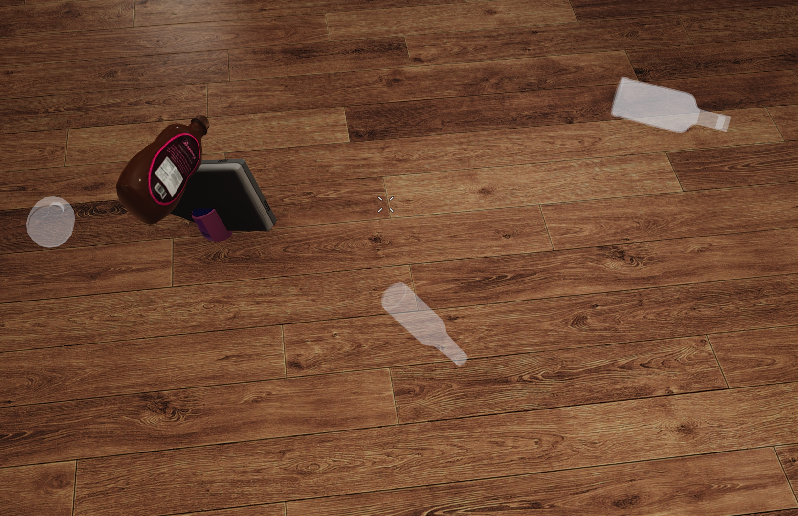
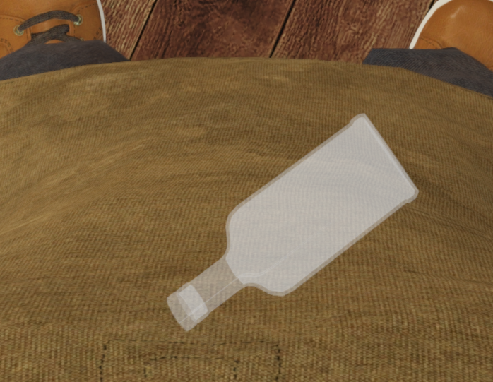
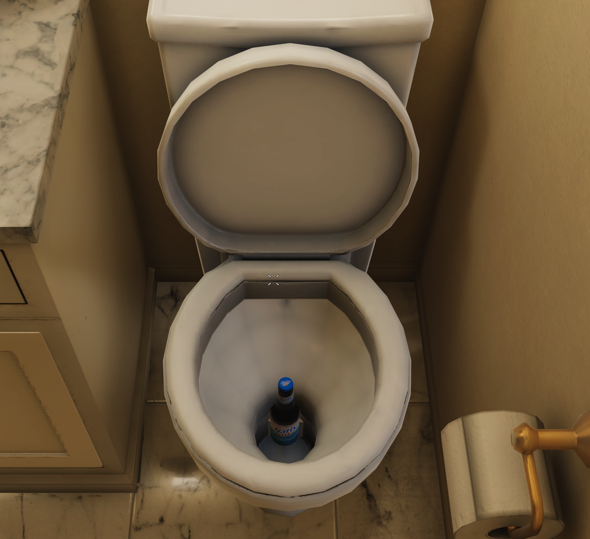
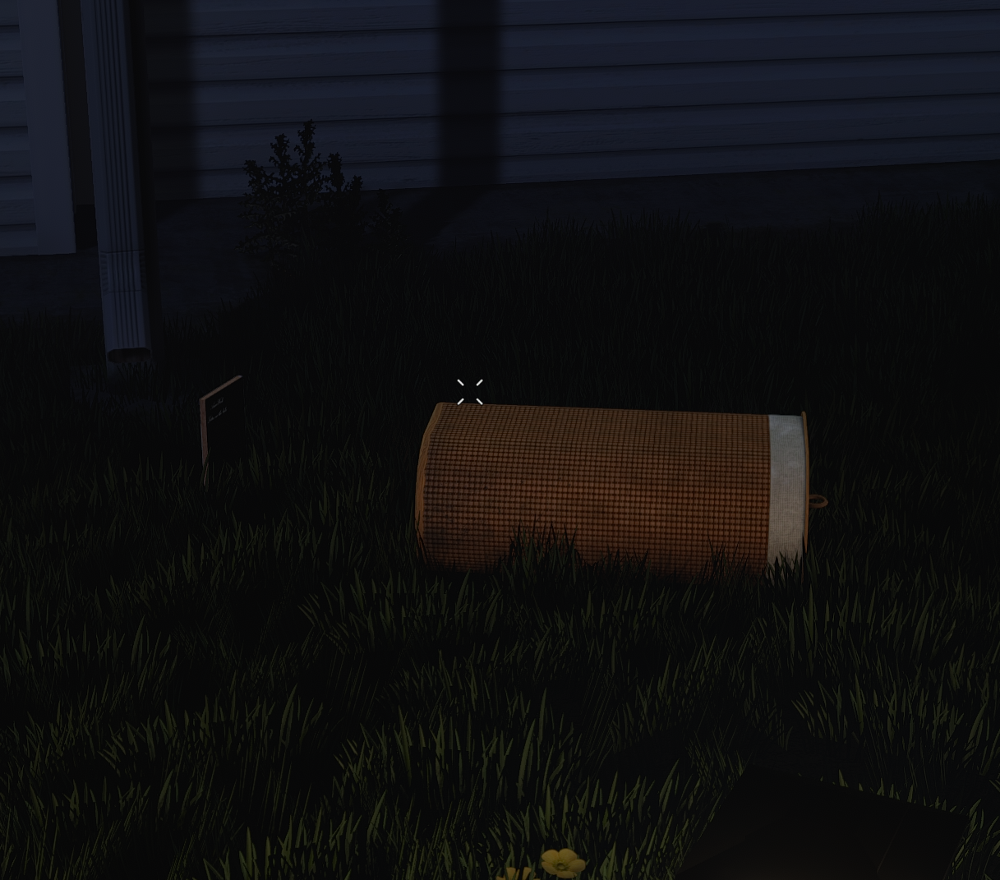
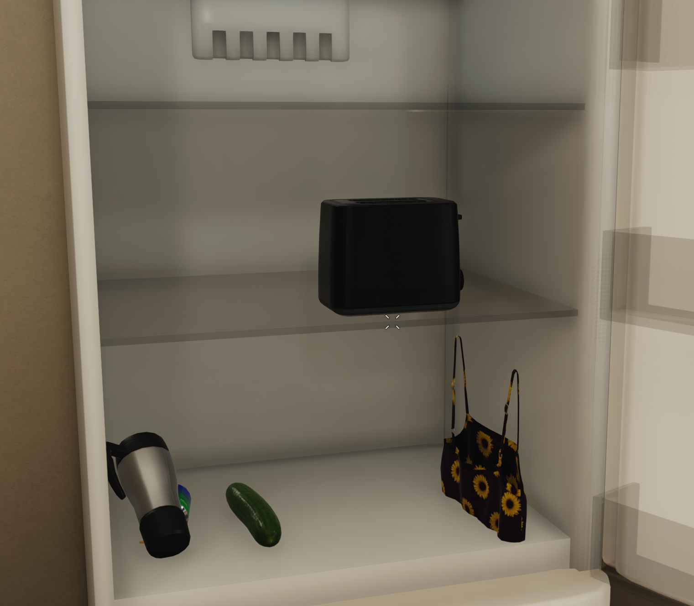
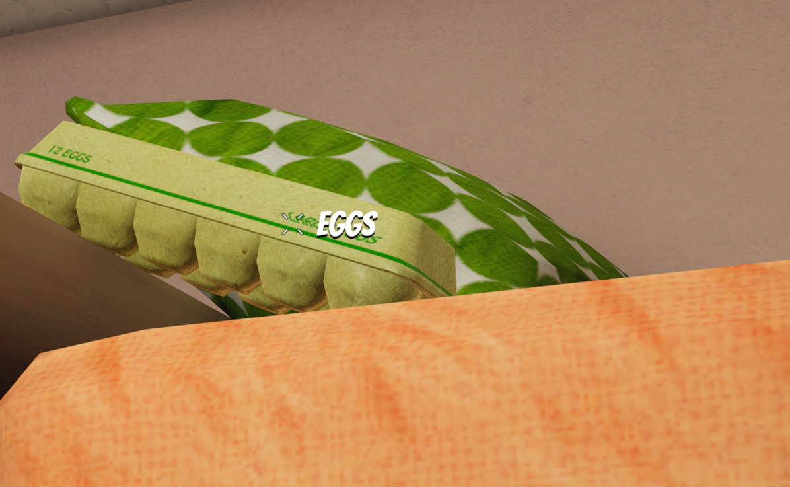

# ItemRandomizer

This mods randomizes the location of interactable items when starting a new game.

> Items clipped through a wall will get a texture which is visable through walls.

# Keybindings

The following keybinding only works when the player is playable

**(hold) `leftCTRL` + (hold) `leftALT` + (numpad) `9`**

- Respawns all items to different location

